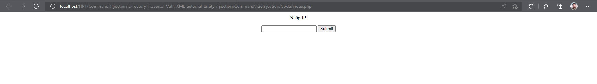
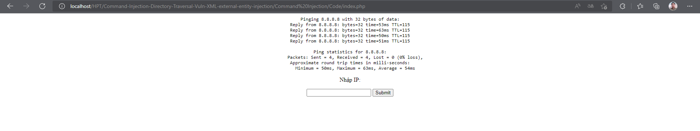
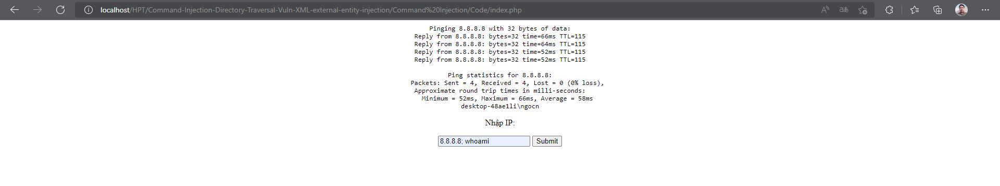
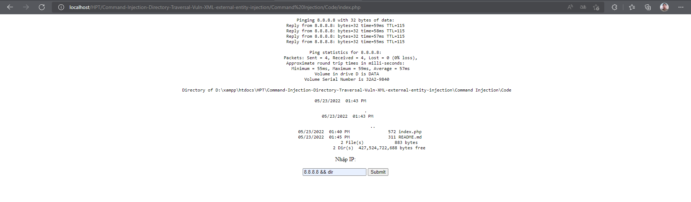
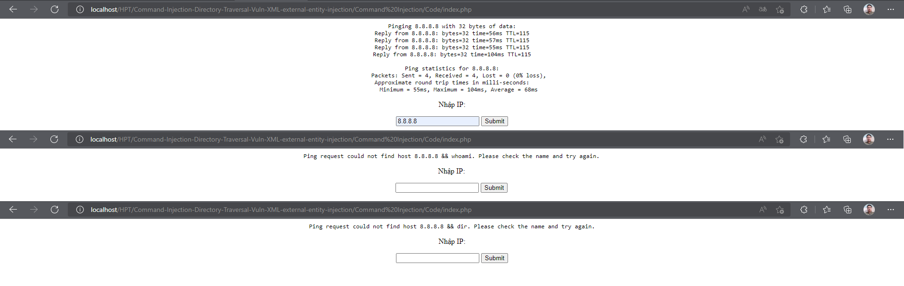

## Người thực hiện: Trần Ngọc Nam
## Thời gian thực hiện: 23/5/2022

- Đây là trang web mắc lỗi Command Injection.
  
  

- Trang web cho phép người dùng ping tới 1 địa chủ ip bất kì. Ví dụ, ta thử ping tới <code>8.8.8.8</code>.
  
  

- Nhưng nếu ta chèn thêm các kí tự đặc biệt để tạo lỗi Command Injection. Ở đây, ta sẽ dùng kí tự <code>&&</code>.
- Ta có thể dễ dàng lấy được thông tin máy chủ với <code>8.8.8.8 && whoami</code> hay liệt kê file cùng thư mục với <code>8.8.8.8 && dir</code>.
  
  

  

- Điều này rất nguy hiểm nếu kẻ tấn công lợi dụng điều này để đánh cắp thông tin hoặc kiểm soát máy chủ.
- Để ngăn ngừa được điều này. Ta cần tiến hành kiểm tra dữ liệu đầu vào do người dùng nhập vào.
- Thay vì trực tiếp chấp nhận dữ liệu đầu vào.
  ```php
  cmd = shell_exec('ping ' . $target);
  ```
- Ta sẽ dùng thêm:
  - Hàm <code>escapeshellcmd</code> để thoát khỏi bất kỳ ký tự nào trong một chuỗi có thể được sử dụng để đánh lừa một lệnh shell để thực hiện các lệnh tùy ý.
  - Hàm <code>escapeshellarg</code> để thêm các dấu ngoặc kép đơn xung quanh một chuỗi và trích dẫn / thoát khỏi bất kỳ trích dẫn duy nhất hiện có nào cho phép bạn chuyển một chuỗi trực tiếp đến một hàm vỏ và có nó được coi là một đối số an toàn duy nhất.

  ```php
  $cmd = shell_exec(escapeshellcmd("ping " . escapeshellarg($target)));
  ``` 

- Và đây là kết quả sau khi thực hiện ngăn chặn.
  
  