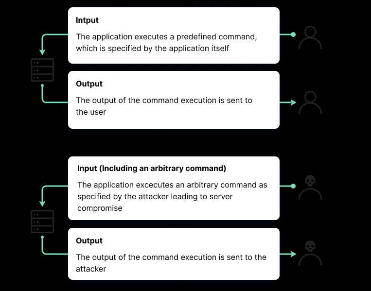

## Người thực hiện: Trần Ngọc Nam
## Thời gian thực hiện: 23/5/2022

# Mục lục
- [Mục lục](#mục-lục)
  - [Command Injection là gì?](#command-injection-là-gì)
  - [Code Injection vs Command Injection:](#code-injection-vs-command-injection)
    - [Code Injection:](#code-injection)
    - [Command Injection:](#command-injection)
  - [Cách hoạt động của Command Injection:](#cách-hoạt-động-của-command-injection)

## Command Injection là gì?
- Command Injection là một cuộc tấn công mạng liên quan đến việc thực hiện các lệnh tùy ý trên hệ điều hành máy chủ (OS). Thông thường, tác nhân đe dọa tiêm các lệnh bằng cách khai thác lỗ hổng ứng dụng, chẳng hạn như xác nhận đầu vào không đủ.
- Ví dụ: kẻ tấn công có thể sử dụng việc truyền dữ liệu người dùng không an toàn như cookie và biểu mẫu, để đưa lệnh vào vỏ hệ thống trên máy chủ web. Sau đó, kẻ tấn công có thể tận dụng các đặc quyền của ứng dụng dễ bị tấn công để xâm phạm máy chủ.
- Command Injection có nhiều hình thức khác nhau:
  - Thực hiện trực tiếp các lệnh shell
  - Tiêm các tệp độc hại vào môi trường thời gian chạy của máy chủ
  - Khai thác các lỗ hổng trong các tệp cấu hình

## Code Injection vs Command Injection:

### Code Injection:

- Code Injection lợi dụng việc xử lý sai các đầu vào dữ liệu không đáng tin cậy
- Được thực hiện bằng cách thiếu xác nhận dữ liệu đầu vào / đầu ra thích hợp.
- Hạn chế quan trọng của Code Injection là bị giới hạn trong ứng dụng hoặc hệ thống mà chúng nhắm tới. Nếu kẻ tấn công có thể tiêm mã PHP vào một ứng dụng và thực thi nó, mã độc sẽ bị giới hạn bởi chức năng PHP và quyền được cấp cho PHP trên máy chủ.

### Command Injection:
- Command Injection thường liên quan đến việc thực hiện các lệnh trong vỏ hệ thống hoặc các phần khác của môi trường.
- Kẻ tấn công mở rộng chức năng mặc định của một ứng dụng dễ bị tấn công, khiến nó chuyển lệnh vào vỏ hệ thống mà không cần tiêm mã độc.
- Trong nhiều trường hợp, Command Injection cho phép kẻ tấn công kiểm soát tốt hơn hệ thống mục tiêu.

## Cách hoạt động của Command Injection:
- Bước 1: Kẻ tân công sẽ xác định vị trí lỗ hổng trong một ứng dụng cho phép họ chạy các lệnh hệ điều hành độc hại.
- Bước 2: Kẻ tấn công thiết kế một lệnh sẽ khiến ứng dụng thực hiện một hành động mong muốn trong hệ điều hành máy chủ. Họ thường sử dụng một cơ chế đầu vào như mã HTML, cookie hoặc trường biểu mẫu để đưa lệnh này vào ứng dụng.
- Bước 3: Trình duyệt giải thích lệnh và nó được dịch sang lệnh hệ điều hành trên máy chủ. Kẻ tấn công sau đó có thể thực hiện các lệnh cụ thể trên máy chủ và mạng của hệ thống bị nhiễm.
  

