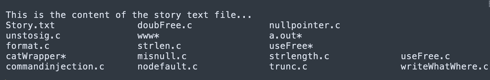

## Người thực hiện: Trần Ngọc Nam
## Thời gian thực hiện: 23/5/2022


# Mục lục:
  - [Command Injection là gì?](#command-injection-là-gì)
  - [Code Injection vs Command Injection:](#code-injection-vs-command-injection)
    - [Code Injection:](#code-injection)
    - [Command Injection:](#command-injection)
  - [Cách hoạt động của Command Injection:](#cách-hoạt-động-của-command-injection)
  - [Ví dụ về Command Injection:](#ví-dụ-về-command-injection)
  - [Các Command Injection phổ biến:](#các-command-injection-phổ-biến)
  - [Phòng ngừa Command Injection:](#phòng-ngừa-command-injection)


## Command Injection là gì?
- Command Injection là một cuộc tấn công mạng liên quan đến việc thực hiện các lệnh tùy ý trên hệ điều hành máy chủ (OS). Thông thường, tác nhân đe dọa tiêm các lệnh bằng cách khai thác lỗ hổng ứng dụng, chẳng hạn như xác nhận đầu vào không đủ.
- Ví dụ: kẻ tấn công có thể sử dụng việc truyền dữ liệu người dùng không an toàn như cookie và biểu mẫu, để đưa lệnh vào vỏ hệ thống trên máy chủ web. Sau đó, kẻ tấn công có thể tận dụng các đặc quyền của ứng dụng dễ bị tấn công để xâm phạm máy chủ.
- Command Injection có nhiều hình thức khác nhau:
  - Thực hiện trực tiếp các lệnh shell
  - Tiêm các tệp độc hại vào môi trường thời gian chạy của máy chủ
  - Khai thác các lỗ hổng trong các tệp cấu hình

## Code Injection vs Command Injection:

### Code Injection:

- Code Injection lợi dụng việc xử lý sai các đầu vào dữ liệu không đáng tin cậy
- Được thực hiện bằng cách thiếu xác nhận dữ liệu đầu vào / đầu ra thích hợp.
- Hạn chế quan trọng của Code Injection là bị giới hạn trong ứng dụng hoặc hệ thống mà chúng nhắm tới. Nếu kẻ tấn công có thể tiêm mã PHP vào một ứng dụng và thực thi nó, mã độc sẽ bị giới hạn bởi chức năng PHP và quyền được cấp cho PHP trên máy chủ.

### Command Injection:
- Command Injection thường liên quan đến việc thực hiện các lệnh trong vỏ hệ thống hoặc các phần khác của môi trường.
- Kẻ tấn công mở rộng chức năng mặc định của một ứng dụng dễ bị tấn công, khiến nó chuyển lệnh vào vỏ hệ thống mà không cần tiêm mã độc.
- Trong nhiều trường hợp, Command Injection cho phép kẻ tấn công kiểm soát tốt hơn hệ thống mục tiêu.

## Cách hoạt động của Command Injection:
- Bước 1: Kẻ tân công sẽ xác định vị trí lỗ hổng trong một ứng dụng cho phép họ chạy các lệnh hệ điều hành độc hại.
- Bước 2: Kẻ tấn công thiết kế một lệnh sẽ khiến ứng dụng thực hiện một hành động mong muốn trong hệ điều hành máy chủ. Họ thường sử dụng một cơ chế đầu vào như mã HTML, cookie hoặc trường biểu mẫu để đưa lệnh này vào ứng dụng.
- Bước 3: Trình duyệt giải thích lệnh và nó được dịch sang lệnh hệ điều hành trên máy chủ. Kẻ tấn công sau đó có thể thực hiện các lệnh cụ thể trên máy chủ và mạng của hệ thống bị nhiễm.
  
  

## Ví dụ về Command Injection:
- Ta có 1 đoạn code C như sau
  ```php
  #include <stdio.h>
  #include <unistd.h>
  
  int main(int argc, char **argv){
      char cat[] = "cat";
      char *command;
      size_t commandLength;
      
      commandLength = strlen(cat) + str(argv[1]) + 1;
      command = (char *) malloc(commandLength);
      strncpy(command, cat, commandLength);
      strncat(command, argv[1], (commandLength = strlen(cat)));
      
      system(command);
      return(0);
      }
  ```
- Vấn đề với mã này là nó không xác nhận tham số đầu vào.
- Nếu kẻ tấn công thực hiện <code>$ ./catWrapper "Story.txt; ls"</code>
- Đầu ra sẽ hiển thị nội dung của tệp <code>Story.txt</code>, nhưng sẽ tiếp tục thực hiện phần còn lại của tham số đầu vào. Ký tự <code>;</code> chỉ ra một break, và đoạn mã phái sau sẽ là một lệnh mới. Trong trường hợp này, lệnh <code>ls</code> sẽ được thực thi và chương trình in nội dung của thư mục hiện tại.
  
  

- Kẻ tấn công có thể thay thế <code>ls</code> bằng một chuỗi các lệnh có thể thực hiện các hành động độc hại trên máy chủ. Nếu ứng dụng catWrapper được phép chạy với các đặc quyền gốc, điều này sẽ cho phép kẻ tấn công kiểm soát hoàn toàn máy chủ.

## Các Command Injection phổ biến:
- Arbitrary command injection: Các ứng dụng có thể nhận được các lệnh hệ thống tùy ý trực tiếp từ người dùng cuối. Khi ứng dụng nhận được các lệnh, nó sẽ thực hiện chúng trên máy chủ. Đây là một lỗ hổng phổ biến cho phép tiêm lệnh.
- Arbitrary File Uploads: Nếu một ứng dụng cho phép người dùng tải lên các tệp có phần mở rộng tệp tùy ý, các tệp này có thể bao gồm các lệnh độc hại. Trên hầu hết các máy chủ web, việc đặt các tệp như vậy trong webroot sẽ dẫn đến việc tiêm lệnh.
- Insecure serialization: Mã phía máy chủ thường được sử dụng để giải mã đầu vào của người dùng. Nếu quá trình giải mã hóa được thực hiện mà không có xác minh thích hợp, nó có thể dẫn đến việc đưa vào lệnh.
- Server-side template injection (SSTI): Các ứng dụng web đôi khi sử dụng các công cụ templating phía máy chủ, như Twig hoặc Jinja2, khi tạo ra các phản hồi HTML động. SSTI xảy ra khi đầu vào của người dùng được nhúng không an toàn trong một mẫu theo cách cho phép kẻ tấn công thực thi mã từ xa trên máy chủ.
- XML external entity injection (XXE): xảy ra trong các ứng dụng sử dụng phân tích XML có cấu hình kém để phân tích đầu vào XML do người dùng kiểm soát. Lỗ hổng này có thể gây lộ dữ liệu nhạy cảm, giả mạo yêu cầu phía máy chủ (SSRF) hoặc các cuộc tấn công từ chối dịch vụ(DoS).

## Phòng ngừa Command Injection:
- Không chạy lệnh hệ thống với đầu vào do người dùng cung cấp.
- Thiết lập xác thực đầu vào.
- Sử dụng nguyên tắc đặc quyền ít nhất.
- Chỉ sử dụng API an toàn.
- Sử dụng execFile() một cách an toàn.